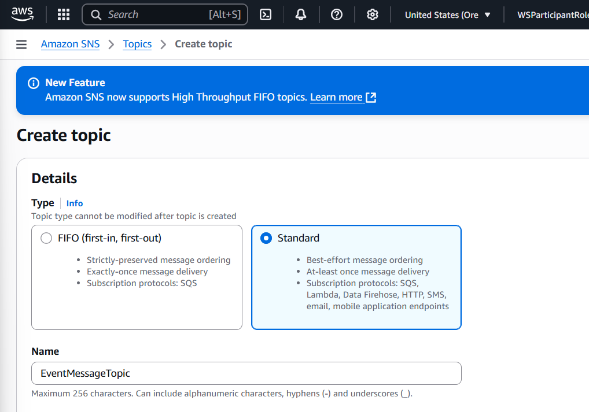
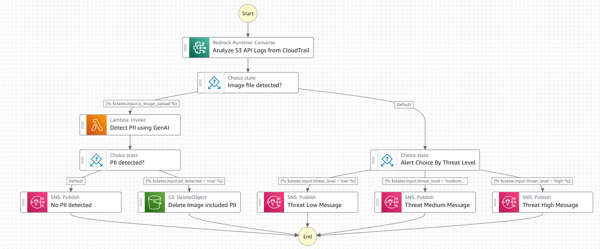

챗봇

1. S3 생성

2. Lambda 함수

```
import boto3
import base64
import json

s3 = boto3.client('s3')
bedrock_runtime = boto3.client('bedrock-runtime', region_name='us-west-2')

def lambda_handler(event, context):
   # Extract S3 bucket and object key from event
   bucket_name = event['s3_bucket']
   object_key = event['s3_key']
   media_type = event['media_type']

   # Download S3 object
   response = s3.get_object(Bucket=bucket_name, Key=object_key)
   image_content = response['Body'].read()

   # Encode image to base64
   base64_encoded_image = base64.b64encode(image_content).decode('utf-8')

   # Create payload for Bedrock call, model parameters can be modified for desired results
   payload = {
       "modelId": "anthropic.claude-3-5-sonnet-20241022-v2:0",
       "contentType": "application/json",
       "accept": "application/json",
       "body": {
           "anthropic_version": "bedrock-2023-05-31",
           "max_tokens": 1024,
           "top_k": 250,
           "top_p": 0.999,
           "temperature": 0,
           "messages": [
               {
                   "role": "user",
                   "content": [
                       {
                           "type": "image",
                           "source": {
                               "type": "base64",
                               "media_type": media_type,
                               "data": base64_encoded_image
                           }
                       },
                       {
                           "type": "text",
                           "text": "Please provide only a Boolean type result - 'true' if the image contains personally identifiable information (PII), 'false' if it does not. You must only return boolean value(true or false)."
                       }
                   ]
               }
           ]
       }
   }

   # Convert the payload to bytes
   body_bytes = json.dumps(payload['body']).encode('utf-8')

   # Invoke the model
   response = bedrock_runtime.invoke_model(
       body=body_bytes,
       contentType=payload['contentType'],
       accept=payload['accept'],
       modelId=payload['modelId']
   )

   # Process the response
   response_body = json.loads(response['body'].read())
   result = response_body['content'][0]['text']

   # If you need the complete response, return just response_body
   return result
```


3. Lambda 정책

```
{
    "Version": "2012-10-17",
    "Statement": [
        {
            "Sid": "AllowInvokeModel",
            "Effect": "Allow",
            "Action": "bedrock:InvokeModel",
            "Resource": "*"
        },
        {
            "Sid": "AllowGetObject",
            "Effect": "Allow",
            "Action": "s3:GetObject",
            "Resource": "arn:aws:s3:::YOUR_BUCKET_NAME/*"
        }
    ]
}
```

4. s3 버킷에 대한 CloudTrail - S3 데이터 이벤트 트레일 생성

- CloudTrail명 : s3PutObjectTrail

5. 게시 이벤트 알림을 위한 SNS 주제 생성


6. 보안 감사 및 자동화 워크플로 구성

```
{
  "QueryLanguage": "JSONata",
  "Comment": "A description of my state machine",
  "StartAt": "Analyze S3 API Logs from CloudTrail",
  "States": {
    "Analyze S3 API Logs from CloudTrail": {
      "Type": "Task",
      "Arguments": {
        "ModelId": "anthropic.claude-3-haiku-20240307-v1:0",
        "InferenceConfig": {
          "MaxTokens": 2048,
          "Temperature": 0.5
        },
        "Messages": [
          {
            "Role": "user",
            "Content": [
              {
                "Text": "{% 'Your a cloud security team.\n\nThe information in the <log> tag below is log information from AWS CloudTrail, and you need to analyze and summarize it in the form of the content of the <sample> tag.\n\nPlease provide your answers in JSON only.\n\n<log>' & $states.input & '</log>\n\n<example>\n{\n\t\"event_title\": \"[Event Name][AWS Account ID][Performed Identity] in the following format.\",\n\t\"summarize\": \"Detailed summary for event analysis\",\n\t\"threat_level\": \"Please provide the threat level of the event as one of three (low, medium, high).\",\n\t\"s3_bucket\": \"For S3 events, bucket name. If not, provide null”\",\n\t\"s3_key\": \"For S3 events, object key. Provide null if not.\",\n    \"is_image_upload\": \"For PutObject event of S3, please provide true if this is an image file upload, otherwise false. Make sure that this value is boolean, not string.\",\n    \"media_type\": \"If this is an image file upload, please provide the MIME type.\"\n}\n</example>' %}"
              }
            ]
          }
        ]
      },
      "Resource": "arn:aws:states:::aws-sdk:bedrockruntime:converse",
      "Next": "Image file detected?",
      "Output": ""
    },
    "Image file detected?": {
      "Type": "Choice",
      "Choices": [
        {
          "Next": "Detect PII using GenAI",
          "Condition": ""
        }
      ],
      "Default": "Alert Choice By Threat Level"
    },
    "Detect PII using GenAI": {
      "Type": "Task",
      "Resource": "arn:aws:states:::lambda:invoke",
      "Arguments": {
        "FunctionName": "arn:aws:lambda:us-west-2:123456789012:function:YOUR-LAMBDA:$LATEST",
        "Payload": {
          "s3_bucket": "",
          "s3_key": "",
          "media_type": ""
        }
      },
      "Retry": [
        {
          "ErrorEquals": [
            "Lambda.ServiceException",
            "Lambda.AWSLambdaException",
            "Lambda.SdkClientException",
            "Lambda.TooManyRequestsException"
          ],
          "IntervalSeconds": 1,
          "MaxAttempts": 3,
          "BackoffRate": 2,
          "JitterStrategy": "FULL"
        }
      ],
      "Next": "PII detected?",
      "Assign": {
        "is_contain_danger": ""
      },
      "Output": {
        "Input": "",
        "pii_detected": ""
      }
    },
    "PII detected?": {
      "Type": "Choice",
      "Choices": [
        {
          "Next": "Delete Image included PII",
          "Condition": "",
          "Output": ""
        }
      ],
      "Default": "No PII detected"
    },
    "No PII detected": {
      "Type": "Task",
      "Resource": "arn:aws:states:::sns:publish",
      "Arguments": {
        "Message": "",
        "TopicArn": "arn:aws:sns:us-west-2:123456789012:YOUR-SNS"
      },
      "End": true
    },
    "Delete Image included PII": {
      "Type": "Task",
      "Arguments": {
        "Bucket": "",
        "Key": ""
      },
      "Resource": "arn:aws:states:::aws-sdk:s3:deleteObject",
      "End": true
    },
    "Alert Choice By Threat Level": {
      "Type": "Choice",
      "Choices": [
        {
          "Next": "Threat High Message",
          "Condition": ""
        },
        {
          "Next": "Threat Medium Message",
          "Condition": ""
        },
        {
          "Next": "Threat Low Message",
          "Condition": ""
        }
      ]
    },
    "Threat Low Message": {
      "Type": "Task",
      "Resource": "arn:aws:states:::sns:publish",
      "Arguments": {
        "Message": "",
        "TopicArn": "arn:aws:sns:us-west-2:123456789012:YOUR-SNS"
      },
      "End": true
    },
    "Threat Medium Message": {
      "Type": "Task",
      "Resource": "arn:aws:states:::sns:publish",
      "Arguments": {
        "Message": "",
        "TopicArn": "arn:aws:sns:us-west-2:123456789012:YOUR-SNS"
      },
      "End": true
    },
    "Threat High Message": {
      "Type": "Task",
      "Resource": "arn:aws:states:::sns:publish",
      "Arguments": {
        "Message": "",
        "TopicArn": "arn:aws:sns:us-west-2:123456789012:YOUR-SNS"
      },
      "End": true
    }
  }
}
```

# 참조
[AWS 참조 아키텍처](https://aws.amazon.com/ko/architecture/?cards-all.sort-by=item.additionalFields.sortDate&cards-all.sort-order=desc&awsf.content-type=*all&awsf.methodology=*all&awsf.tech-category=*all&awsf.industries=*all&awsf.business-category=*all)
[생성형 AI 정리 사이트 - 홍은미 강사님 노션](https://emhong-aws.notion.site/AWS-GenAI-Essentials-78b2fa8035c445cfb48416f8c27000ad)
[]()